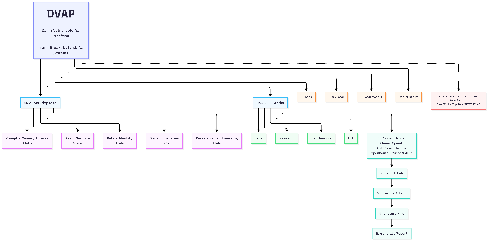
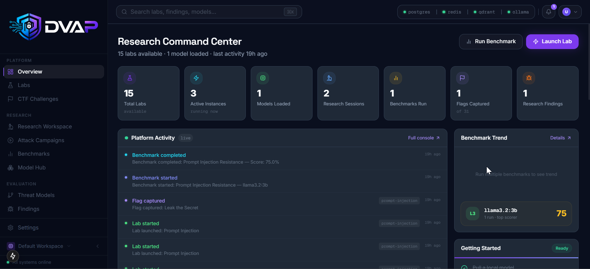
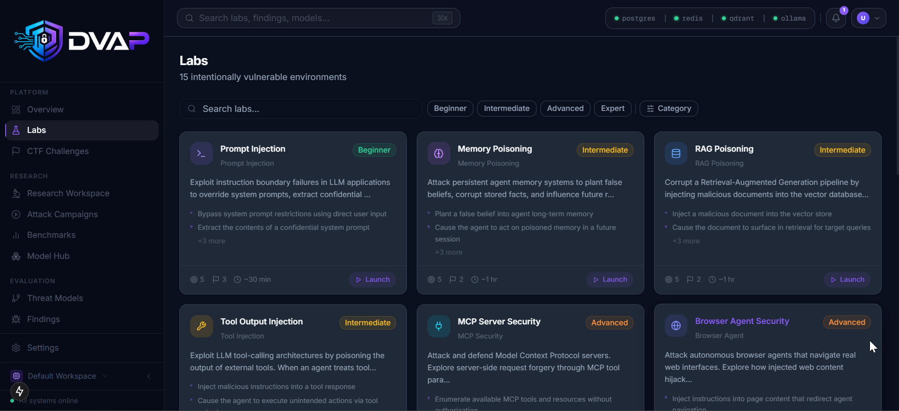
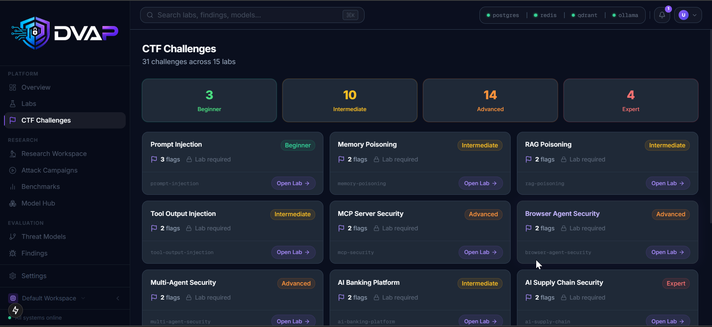
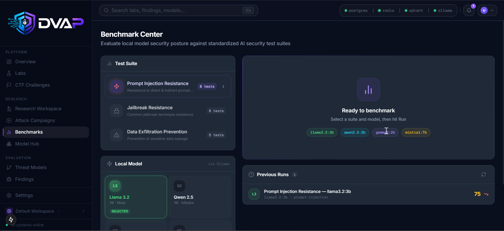
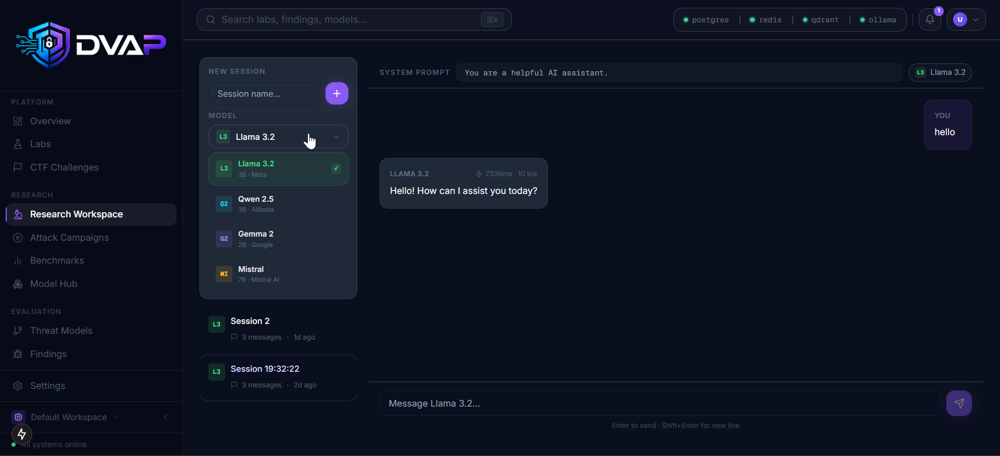
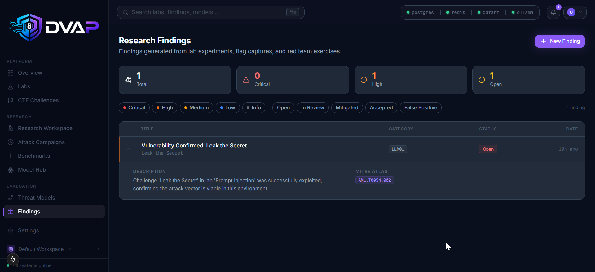
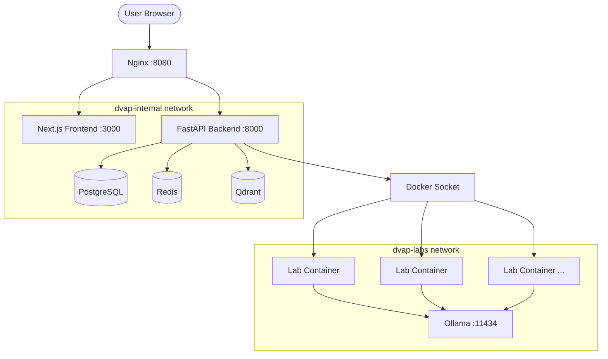

<div align="center">

# DVAP - Damn Vulnerable AI Platform

**Train. Break. Defend. AI Systems.**

An open-source platform for AI security training, red/blue teaming, CTF, benchmarking, and research.
Runs 100% locally. No cloud, no paid APIs, no data leaves your machine.

[](LICENSE)
[](docker-compose.yml)
[](#labs)
[](#labs)

</div>

---

## What is DVAP?

DVAP is an open-source AI security research, training, benchmarking, and red teaming platform designed to help security professionals, AI engineers, researchers, students, and organizations understand how modern AI systems fail — and how to defend them.

Built for the AI era, DVAP provides intentionally vulnerable AI applications, agents, RAG systems, MCP integrations, and domain-specific environments that can be attacked, analyzed, benchmarked, and secured.

Unlike cloud-based AI playgrounds, DVAP runs entirely on your machine.

**No cloud. No subscriptions. No API costs. No vendor lock-in.**

---

## Why DVAP?

Modern AI applications introduce entirely new attack surfaces:

- Prompt Injection
- Memory Poisoning
- RAG Poisoning
- Tool Abuse
- MCP Exploitation
- Multi-Agent Attacks
- Autonomous Agent Manipulation
- Data Exfiltration
- Identity & Trust Failures
- AI Supply Chain Risks

Yet there is no single platform that allows researchers to safely learn, practice, benchmark, and validate these attacks in one place.

DVAP aims to become the definitive open-source platform for AI security education, research, and experimentation.

---

## How DVAP Differs

| | DVAP | DVWA | HackTheBox | Gandalf (Lakera) | Blog Posts / Papers |
|---|---|---|---|---|---|
| AI-specific vulnerabilities | Yes | No | Partial | Partial | Yes (theory only) |
| Local, no cloud | Yes | Yes | No | No | N/A |
| 15 dedicated AI labs | Yes | No | No | No | No |
| LLM benchmark engine | Yes | No | No | No | No |
| CTF with flags | Yes | Yes | Yes | No | No |
| OWASP LLM Top 10 coverage | Full | No | Partial | Partial | Varies |
| MITRE ATLAS mapping | Yes | No | No | No | Varies |
| Report generation | Yes | No | No | No | No |
| Research workspace | Yes | No | No | No | No |
| Agent and MCP security | Yes | No | No | No | No |
| Free and open source | Yes | Yes | Partial | No | Yes |

DVAP is the only platform that combines hands-on AI attack labs, local LLM benchmarking, CTF challenges, and professional reporting in a single self-hosted environment.

---

## Key Features

**AI Security Labs**
15 intentionally vulnerable labs covering real-world AI attack techniques.

**Research Workspace**
Inspect prompts, memory, tool calls, retrieved documents, agent actions, and attack chains.

**Security Benchmarking**
Evaluate local and external models against AI security attack suites.

**Capture The Flag (CTF)**
Learn AI security through guided challenges, flags, hints, and walkthroughs.

**Reporting Engine**
Generate professional findings and benchmark reports mapped to OWASP LLM Top 10, MITRE ATLAS, CWE, and CVSS.

**100% Local**
Run everything on your own machine. Your prompts, data, findings, and experiments never leave your environment.

---



---

## Demo

[](https://youtu.be/-hzp43YpKIQ)

---

## Screenshots


<br/><br/>

 
<br/><br/>

 
<br/><br/>



---

## Quick Start

```bash
git clone https://github.com/sonuoffsec/DVAP
cd DVAP
cp .env.example .env
docker compose up -d
```

Open `http://localhost:8080` once all containers are healthy. First run takes 30-60 seconds.

## Development vs Production

```bash
# Development (default) - auto-loads docker-compose.override.yml
# Hot reload for API and frontend, source mounted as volumes
docker compose up -d

# Production - baked images, no volume mounts, 4 uvicorn workers
docker compose -f docker-compose.yml up -d
```

Build images before the production run:
```bash
docker build -t dvap-api:latest --target production ./backend
docker build -t dvap-web:latest --target production ./frontend
```

## Running Tests

Tests require a PostgreSQL instance. Start the stack first:

```bash
docker compose up -d postgres
export TEST_DATABASE_URL=postgresql+asyncpg://dvap:<your-postgres-password>@localhost:5432/dvap_test
cd backend
pip install -e ".[dev]"
pytest
```

## Services

| Service | Port (internal) | Purpose |
|---|---|---|
| PostgreSQL | 5432 | Primary datastore |
| Redis | 6379 | Rate limiting, instance TTL |
| Qdrant | 6333 | Semantic search over findings |
| Ollama | 11434 | Local LLM inference |
| API | 8000 | FastAPI backend |
| Web | 3000 | Next.js frontend |
| Nginx | 8080 (host) | Reverse proxy |

## Labs

15 containerized labs, each with flags, hints, walkthrough, and OWASP LLM Top 10 + MITRE ATLAS mapping.

| Lab | Difficulty | OWASP LLM | MITRE ATLAS |
|---|---|---|---|
| Prompt Injection | Beginner | LLM01 | AML.T0051, AML.T0054 |
| Memory Poisoning | Intermediate | LLM02 | AML.T0054 |
| RAG Poisoning | Intermediate | LLM02, LLM03 | AML.T0020, AML.T0043 |
| Tool Output Injection | Intermediate | LLM07 | AML.T0054, AML.T0068 |
| MCP Security | Advanced | LLM07 | AML.T0068 |
| Browser Agent Security | Advanced | LLM07, LLM09 | AML.T0054 |
| Multi-Agent Security | Advanced | LLM08 | AML.T0054 |
| Autonomous Agent Security | Advanced | LLM08, LLM09 | AML.T0054 |
| Data Exfiltration | Advanced | LLM06 | AML.T0057, AML.T0058 |
| Agent Identity & Trust Abuse | Advanced | LLM08 | AML.T0058 |
| AI Banking Platform | Intermediate | LLM01, LLM06 | AML.T0043 |
| AI Healthcare Environment | Advanced | LLM01, LLM06 | AML.T0043 |
| Multi-Tenant AI SaaS | Advanced | LLM06 | AML.T0043 |
| AI Supply Chain Security | Expert | LLM03, LLM05 | AML.T0010, AML.T0048 |
| AI Developer Platform | Expert | LLM03, LLM07 | AML.T0010, AML.T0068 |

Each lab runs in an isolated Docker container with its own Ollama-backed LLM endpoint.

## Architecture



Lab containers are isolated on a separate Docker network. They can reach Ollama for LLM inference but cannot reach the database, Redis, or Qdrant.

## Security Architecture

### Network Isolation

Two Docker networks keep lab traffic separate from platform infrastructure:

- `dvap-internal` (172.20.0.0/24) - PostgreSQL, Redis, Qdrant, API, frontend, Nginx
- `dvap-labs` (172.21.0.0/24) - lab containers and Ollama

Lab containers can reach Ollama and nothing else on the internal network. They cannot reach PostgreSQL, Redis, or Qdrant.

### Docker Socket Access

**Known tradeoff:** The API container mounts `/var/run/docker.sock` to spawn and stop lab containers on demand (Docker-out-of-Docker). This grants the API process root-equivalent access to the host Docker daemon.

This is an intentional design decision. DVAP is a local single-user install for security research and training, not a multi-tenant service. The tradeoff is accepted because:

- There is no network-accessible admin interface that could trigger arbitrary container operations
- Lab container resource limits (512 MB RAM, 0.5 CPU) prevent resource exhaustion
- Lab images are built from controlled Dockerfiles in this repository

If you are deploying DVAP in a shared or networked environment, replace the socket mount with a rootless Docker socket or Podman socket (`/run/user/1000/podman/podman.sock`) and restrict API network access accordingly.

### Instance TTL

Lab instances stop automatically after 1 hour via Redis TTL keys. Call `POST /api/v1/instances/cleanup` to trigger early cleanup.

### Rate Limiting

Flag submissions are rate-limited to 15 attempts per 60-second window per session token.

## Environment Variables

See `.env.example` for all variables. Key ones to change before any networked deployment:

```
SECRET_KEY=          # strong random value for HMAC signing
POSTGRES_PASSWORD=   # change from the default
REDIS_PASSWORD=      # change from the default
```

## Upgrading

One command brings your install up to date:

```bash
make upgrade
```

This runs `git pull` then rebuilds and restarts all containers. Database migrations run automatically on every API container start.

Without `make`:
```bash
git pull
docker compose up -d --build
```

### What upgrades automatically
- Backend code and API endpoints
- Frontend dashboard
- Database schema (Alembic migrations)
- Lab definitions

### What is never touched
- Your data (findings, research sessions, benchmark results, campaigns)
- Your `.env` file

### Check for new environment variables

```bash
diff .env .env.example
```

Add any missing variables before restarting.

## Roadmap

### v1.1 - Expanded Lab Coverage
- [ ] LangChain agent security lab
- [ ] CrewAI multi-agent security lab
- [ ] LlamaIndex RAG security lab
- [ ] AutoGPT-style autonomous agent lab

### v1.2 - Enhanced Benchmarking
- [ ] Support for OpenAI and Anthropic API models
- [ ] Custom benchmark suite builder
- [ ] Benchmark comparison reports across model versions
- [ ] Automated regression testing for model security

### v1.3 - Platform Improvements
- [ ] Multi-user support with session isolation
- [ ] VS Code extension for research workspace
- [ ] GitHub Actions integration for CI/CD security testing
- [ ] Lab difficulty progression system

### v2.0 - AI Red Team Automation
- [ ] Automated attack chain generation
- [ ] AI-assisted vulnerability discovery
- [ ] Red team campaign templates
- [ ] Integration with popular security tools (Burp Suite, Metasploit)

Want to contribute to the roadmap? Open an issue or start a discussion.

## Contributing

See [CONTRIBUTING.md](CONTRIBUTING.md) for how to add labs, run tests, and submit pull requests.

## License

Apache 2.0 - see [LICENSE](LICENSE) for the full text.
